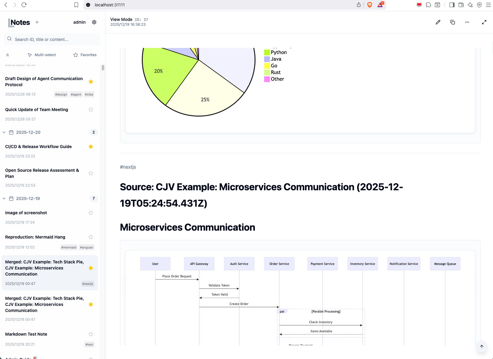
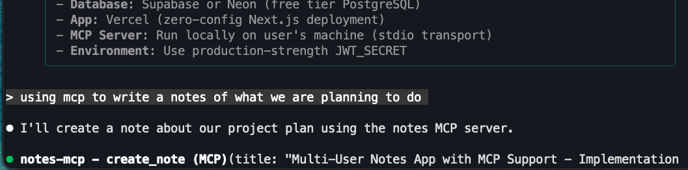
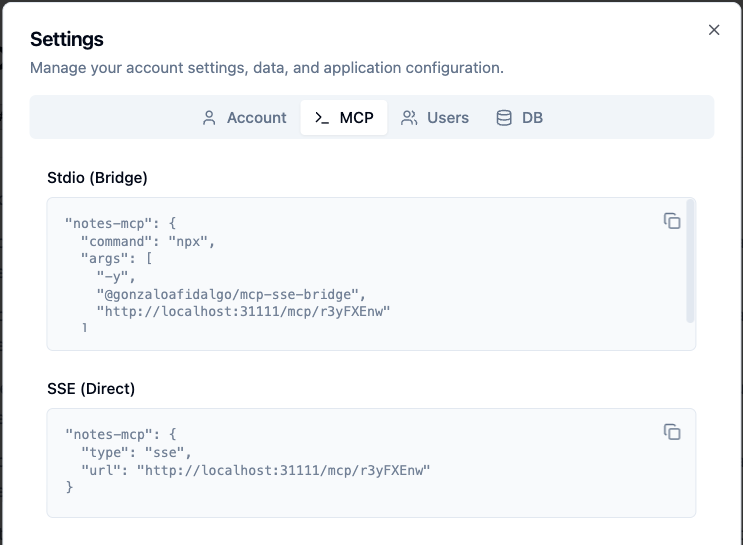

# Local Notes MCP

[](https://choosealicense.com/licenses/mit/)
[](https://nodejs.org/)
[](https://www.docker.com/)
[](https://modelcontextprotocol.io/)

A simple, local-first note-taking application designed for AI assistants and human users.

**Why Local Notes MCP?**

1.  **Peace of Mind (Local First)**: We often need to store sensitive information like API keys, passwords, or server addresses. Storing these on the cloud is risky. This app keeps your data 100% local, offering a much safer alternative.
2.  **AI Agent Memory**: Coding agents need a place to summarize documents and persist context outside of the code editor. Current solutions are either complex cloud systems or lack MCP integration. This app serves as an external memory bank that both you and your AI can access, allowing you to ask your agent to "retrieve notes from last week" or "append a summary of this session".

## Quick Start

### 1. Start the App

Run the application using Docker (works on Windows, Mac, and Linux):

```bash
docker run -d \
  --name local-notes-mcp \
  -p 31111:31111 \
  -v local_notes_mcp_data:/app/data \
  ghcr.io/mchen-lab/local-notes-mcp:latest
```


### 2. Create User & Login

Since this is a multi-user web app, you first need to create a user account.
1. Open the app in your browser at [http://localhost:31111](http://localhost:31111).
2. Create a username and password.
3. Log in.

### 3. Configure the Agent

1. Click the **Gear Icon (Settings)** in the top right.
2. Switch to the **MCP** tab to find your connection information.
3. You will see an **API Key**.
   > **Note:** This API Key is solely for identifying your user account within this local app. It is **not** related to any paid commercial service.
4. Copy the MCP configuration and paste it into your AI Agent's MCP config, or set up Claude Code via command line:

### 4. Ask Your Agent

Now you can ask your agent to interact with your notes. For example:

> "Use MCP to write a concise note about what we have done so far."
 
 ## Screenshots

 ### Main Interface
 
 *Clean, markdown-based note editing with smart tags and search.*

 ### Agent Integration
 
 *Seamlessly asking your AI agent to read and write notes.*

 ### Easy Configuration
 
 <br/>
 *Simple setup for connecting to Claude, Cursor, and other MCP clients.*


 ## Features


### Core Functionality
- 📝 **Markdown Editor**: Full Markdown support with live preview.
- 🖼️ **Image Support**: Paste or drag & drop images directly into notes.
- 📊 **Mermaid Diagrams**: Render flowcharts and diagrams with built-in Mermaid.js.
- 🏷️ **Smart Tags**: Organize with `#hashtags`.
- 🔍 **Search**: Instant fuzzy search across all notes.
- 📅 **Date Grouping**: Organize notes by date.

### Agent Integration (MCP)
- 🤖 **Model Context Protocol**: Native support for connecting to AI agents.
- 🔌 **Dual Transport**: Supports both `stdio` (standard input/output) and `sse` (Server-Sent Events) connections.
- 🧠 **Long-Term Memory**: Agents can search, read, writing, and append to notes.

### Batch Operations
- ✅ **Multi-select**: Delete, export, or merge multiple notes at once.

### User Management
- 🔐 **Multi-user Support**: Secure authentication with individual user accounts.
- 👤 **Admin Panel**: Manage users and backups.

### UI/UX
- 🌙 **Dark Mode**: Toggle between light and dark themes.
- 📱 **Responsive Design**: Works on desktop and mobile.

## Multi-Platform Support

Since this application is built on Docker and Node.js, it runs on all major platforms:
- **macOS** (Intel & Apple Silicon)
- **Windows** (WSL2 / Docker Desktop)
- **Linux** (amd64 & arm64)


## MCP Configuration

This application acts as an MCP Server.

### Setup Recommendations

1.  **Use SSE Config First**: We recommend using the SSE transport URL (`http://localhost:31111/mcp/YOUR_API_KEY`) whenever possible.
2.  **Stdio Fallback**: If SSE is not working for your client, use Stdio.

> **Windows Users**: Use SSE if possible. If you need to use Stdio, you must install **Node.js** so that the `npx` command becomes available.

### Client Support & Known Issues

- **Antigravity**: Does not support SSE right now. You must use Stdio.
- **Cursor**: Supports both SSE and Stdio.
- **Claude Code**: Supports both SSE and Stdio.
- **Other Clients**: Most should work with the SSE endpoint.


## Project Structure

```
local-notes-mcp/
├── backend/               # Express.js server & MCP implementation
├── frontend/             # Single-page React application
└── data/                 # SQLite database & uploaded images
```

## Feedback & Support

- **Found a bug?** Open an [Issue](https://github.com/mchen-lab/local-notes-mcp/issues)
- **Have an idea?** Submit a feature request


 ## Troubleshooting & FAQ
 
 ### How do I update to the latest version?
 Run the following command:
 
 ```bash
 docker pull ghcr.io/mchen-lab/local-notes-mcp:latest && \
 docker stop local-notes-mcp && \
 docker rm local-notes-mcp && \
 docker run -d --name local-notes-mcp -p 31111:31111 -v local_notes_mcp_data:/app/data ghcr.io/mchen-lab/local-notes-mcp:latest
 ```
 
 ### Can I connect to the server from another computer?
 Yes, you can connect to the server from another computer on the same local network using the server's IP address.

For example, if your host computer's IP is `192.168.68.16`, you can access the app from another device at:
`http://192.168.68.16:31111`

**Note:** Connecting via VPN or complex network setups might cause instability with some MCP clients due to timeouts. If you experience issues, try connecting from the same machine or ensure a stable direct local connection.
 
 ## License

MIT License. See [LICENSE](LICENSE) for details.
