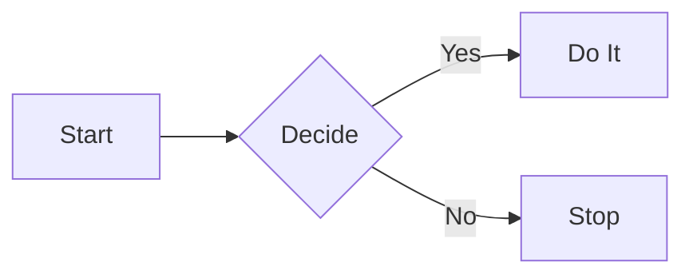

# Local Notes MCP: Quick Start 🚀

Welcome to your personal note-taking app with AI memory capabilities!

---

## 🤖 MCP Setup (AI Agent Memory)

Give your AI assistant (Claude, Cursor, etc.) persistent memory:

1. Click **Settings** (⚙️ gear icon)
2. Open the **MCP** tab
3. Click **Copy Config** 
4. Paste into your AI agent's MCP settings

**Try this prompt:**
> "Write a note summarizing our conversation today"

---

## ✨ Features Overview

### Notes
- **Favorites** ⭐ - Star notes to keep them at the top
- **Tags** - Add `#tag` anywhere in your note for organization
- **Search** - Find notes by title, content, or tags
- **Group By** - Organize by date (Today/Yesterday/Week/Month)

### Editing
- **Edit/Preview** - Toggle between writing and rendered markdown
- **Image Upload** - Paste or drag images directly into notes
- **Markdown Toolbar** - Quick formatting buttons

### Batch Operations
- Click the **Multi-select** icon to select multiple notes
- **Delete** - Remove multiple notes at once
- **Favorite** - Star/unstar selected notes
- **Export** - Download selected notes as JSON
- **Merge** - Combine notes (content merged into the newest note)

### Import/Export
- **Export** - Download all notes as JSON backup
- **Import** - Restore notes from JSON file
- **Print** - Print the current note

---

## 📝 Markdown Reference

| Element | Syntax | Result |
| :--- | :--- | :--- |
| **Headers** | `# H1`, `## H2` | Headings |
| **Bold** | `**text**` | **text** |
| **Italic** | `*text*` | *text* |
| **Links** | `[text](url)` | Clickable link |
| **Lists** | `- item` or `1. item` | Bullets/Numbers |
| **Checklist** | `- [ ] task` | ☐ task |
| **Code** | `` `code` `` | `code` |
| **Quote** | `> text` | Blockquote |
| **Table** | See example below | Table |

### Code Blocks

```javascript
console.log("Hello World");
```

### Mermaid Diagrams



Supports: flowcharts, sequence diagrams, class diagrams, state diagrams, Gantt charts, ER diagrams, pie charts, and more!

---

## ⚙️ Settings

Access via the gear icon (⚙️):

- **Dark Mode** - Toggle light/dark theme
- **Group notes by** - Change date grouping style
- **Account** - Update username/password
- **MCP** - Get AI integration config
