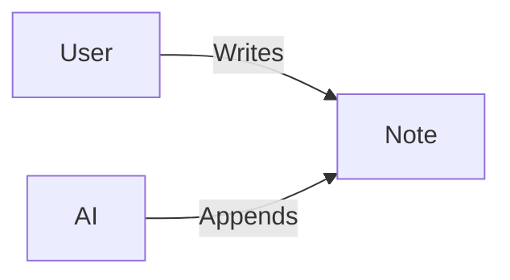

# Local Notes MCP: Quick Start 🚀

Welcome to your personal note-taking app with AI memory capabilities!

---

## 🤖 AI Agent Setup (MCP)

Give your AI assistant (Claude, Cursor, etc.) persistent memory:

1. Click **Settings** (⚙️ gear icon) -> **MCP**.
2. **Copy Config** and paste into your AI agent's settings.
3. **Try this:** Ask your AI to *"Append a summary of this conversation to my notes"*

---

## ✨ Features Overview

### Organization
- **Smart Tags**: Add `#tag` anywhere. Click any tag to filter.
- **Search**: Instant fuzzy search across all notes.
- **Favorites**: Star ⭐ important notes.

### Editing
- **Markdown**: Full support including checklists and tables.
- **Images**: Paste or drag & drop images directly.
- **Diagrams**: Built-in Mermaid.js support.

### Efficiency
- **Back to Top**: Floating button for easy navigation.
- **Batch Actions**: Multi-select notes to delete, export, or merge.
- **Shortcuts**: `Cmd/Ctrl+S` to save, `Cmd/Ctrl+J/K` to navigate.

---

## 📝 Markdown & Mermaid Example

**Checklist:**
- [x] Install Local Notes
- [ ] Connect AI Agent

**Diagram:**

---

## ⚙️ Settings
Access via the gear icon (⚙️) to toggle **Dark Mode**, change **Date Grouping**, or manage your **Account**.
